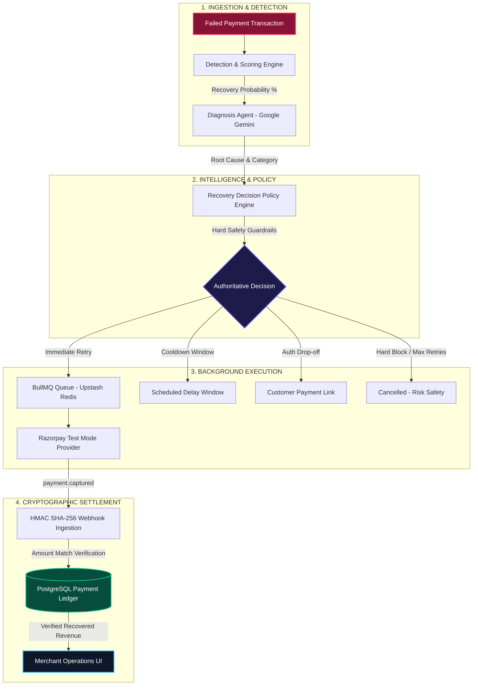

# 💸 RecoverAI — Autonomous AI Payment Recovery Platform

<div align="center">
  
  
  
  
  
  
  
  
  
  
  
</div>

<br />

**RecoverAI** is an institutional-grade, autonomous revenue recovery platform designed to detect, diagnose, and recover lost merchant revenue from failed payment transactions. 

By combining multi-agent LLM diagnostics (Google Gemini), deterministic policy guardrails, Upstash Redis background queues, and Razorpay Test Mode webhooks, RecoverAI transforms passive churn into recovered revenue while maintaining a cryptographically reconciled financial ledger.

---

## 📑 Table of Contents

- [Problem Statement & Solution](#-problem-statement--solution)
- [RecoverAI vs. Legacy Dunning Systems](#-recoverai-vs-legacy-dunning-systems)
- [System Architecture & Lifecycle](#-system-architecture--lifecycle)
- [Recovery Timelines by Policy Strategy](#-recovery-timelines-by-policy-strategy)
- [Monorepo Project Structure](#-monorepo-project-structure)
- [Core Subsystems & Phase Roadmap](#-core-subsystems--phase-roadmap)
- [REST API & Webhook Reference](#-rest-api--webhook-reference)
- [Local Development Setup](#-local-development-setup)
- [Automated Testing & Verification](#-automated-testing--verification)
- [Security & Sandbox Invariants](#-security--sandbox-invariants)

---

## 📌 Problem Statement & Solution

Every year, digital merchants lose up to **9% of total revenue** due to payment failures—caused by temporary bank timeouts, 3D-Secure drop-offs, OTP latency, or false-positive fraud flags.

Traditional payment recovery relies on static, generic email dunning cycles that alienate customers, trigger card network penalties, and report false-positive recoveries.

**RecoverAI** solves this through an autonomous 8-phase architecture:
1. **Real-time Detection & Probability Scoring**: Evaluates recoverable revenue using transaction features and prior customer spend.
2. **AI-Powered Root Cause Diagnosis**: Leverages Google Gemini with structured JSON schema outputs and transparent deterministic fallback.
3. **Authoritative Decision Engine**: Enforces hard safety rules (`RETRY`, `REMIND`, `WAIT`, `ESCALATE`, `STOP`) that override LLM hallucinations.
4. **Cryptographic Financial Reconciliation**: Implements a dedicated PostgreSQL `Payment` ledger where revenue is credited **if and only if** a signed Razorpay `payment.captured` webhook matches the exact transaction amount.

---

## ⚖️ RecoverAI vs. Legacy Dunning Systems

| Feature / Capability | Legacy Dunning (Stripe Billing / Chargebee) | **RecoverAI Autonomous Platform** |
| :--- | :--- | :--- |
| **Recovery Strategy** | Static timed intervals (e.g. Day 1, Day 3, Day 5) | **Dynamic, Root-Cause-Aware Policy** (`RETRY`, `WAIT`, `REMIND`, `ESCALATE`, `STOP`) |
| **Failure Diagnosis** | Generic raw gateway error strings | **Google Gemini AI Root Cause Analysis** with structured JSON output |
| **Hallucination Protection** | N/A (Rule only) | **Authoritative Deterministic Safety Rules** (Hard guardrails override AI when unsafe) |
| **Financial Source of Truth** | Prematurely claims recovery on attempt trigger | **Cryptographic `Payment` Ledger** (Confirmed strictly upon HMAC SHA-256 webhook capture) |
| **Observability** | Basic server logs | **Real-Time System Telemetry Dashboard** (Live PG/Redis latencies, queue depth, AI fallback rate) |
| **Background Processing** | Cron job batch polling | **Upstash Redis + BullMQ Queue** with concurrency = 5 and exponential backoff |
| **Tenant Isolation** | Single-tenant or shared state | **Multi-Tenant RBAC** (`User` + `MerchantMembership` with granular roles) |

---

## 🏗️ System Architecture & Lifecycle



---

## ⏱️ Recovery Timelines by Policy Strategy

Payment recovery does not follow a static timeline. Instead, execution timing and customer retention are dynamically tuned to the **failure root cause**:

```text
+---------------------------------------------------------------------------------------------------+
|                                 RECOVERAI DECISION LIFECYCLE                                      |
+---------------------------------------------------------------------------------------------------+
|   Failed Payment ---> Detection Score ---> AI Diagnosis (Gemini) ---> Authoritative Policy Engine |
|                                                                                |                  |
|          +----------------------+--------------------+-------------------------+                  |
|          |                      |                    |                         |                  |
|          v                      v                    v                         v                  |
|     [ RETRY ]                [ WAIT ]            [ REMIND ]                 [ STOP ]              |
|   Smart Re-attempt      Cooldown Window       Customer Link             Hard Policy Block         |
|   (0 - 5 Minutes)      (15 - 30 Minutes)     (1 - 24 Hours)                (Terminated)           |
|          |                      |                    |                                            |
|          +----------------------+--------------------+                                            |
|                                 |                                                                 |
|                                 v                                                                 |
|                   Razorpay Test Mode Order / Link                                                 |
|                                 |                                                                 |
|                                 v (HMAC SHA-256 Webhook: payment.captured)                        |
|                                                                                                   |
|           PostgreSQL Payment Ledger Reconciled (Verified Recovered = ₹Amount)                     |
+---------------------------------------------------------------------------------------------------+
```

### Policy Timeline & Retention Matrix

| Policy Action | Root Cause & Failure Category | Typical Recovery Window | How It Works & Lifecycle | Retention Benchmark |
| :--- | :--- | :---: | :--- | :---: |
| **`RETRY`** *(Smart Retry)* | Bank Gateway Timeout, Temporary Infrastructure Failure, Network Drop | **0 – 5 Minutes** | Dispatches a background retry order to Razorpay. As soon as the customer or bank captures the transaction, webhook confirms settlement. | **70% – 85%** of temporary failures |
| **`WAIT`** *(Cooldown Window)* | Bank Server Congestion, UPI Peak Hour Spike, High Churn Risk | **15 – 30 Minutes** | Halts immediate retries to prevent duplicate friction. Schedules a cooldown window (`defaultWaitMinutes = 30`) and retries once bank rails stabilize. | **50% – 65%** of transient failures |
| **`REMIND`** *(Customer Link)* | 3D-Secure Drop-off, OTP Timeout, Authentication Failure | **1 – 24 Hours** | Dispatches a customized payment recovery link via Email/SMS. Amount is recovered when the customer clicks the link and authenticates. | **35% – 55%** of drop-offs |
| **`ESCALATE`** *(Manual Review)* | High-Value VIP Transaction, Unclassified Error, Low Confidence | **2 – 12 Hours** | Flags the transaction in the dashboard for manual agent/merchant support review. | **40% – 60%** of escalated volume |
| **`STOP`** *(Hard Safety Block)* | Expired Card, Max 3 Retries Exceeded, Repeated Insufficient Funds | **Immediate (0s)** | Permanently halts recovery to protect the merchant from chargebacks, bank penalties, or customer annoyance. | *N/A (Loss Prevention)* |

> [!IMPORTANT]
> **Core Financial Invariant**: *Execution Succeeded $\neq$ Money Recovered*. When an action is dispatched, RecoverAI marks the attempt as `Pending` with `₹0 (Pending Webhook)`. Revenue is ONLY credited to analytics when verified via cryptographic webhook matching the exact paise amount.

---

## 🗂️ Monorepo Project Structure

```text
Recover_AI/
├── client/                                # React 18 + Vite Frontend Dashboard
│   ├── src/components/ui/                 # MetricCard, SystemHealthCard, StatusBadge, Skeleton
│   ├── src/pages/                         # OverviewPage, RecoveryCenterPage, TransactionDetailPage, SettingsPage
│   ├── src/services/                      # Typed REST API Client & Webhook Triggers
│   └── src/types/                         # TypeScript interfaces for financial ledger & observability
│
├── server/                                # Express REST API Backend
│   ├── src/modules/
│   │   ├── detection/                     # Phase 3: Recovery Probability Scoring Engine
│   │   ├── diagnosis/                     # Phase 4: Gemini LLM Root-Cause Diagnostics
│   │   ├── recovery-decision/             # Phase 5: Deterministic Decision Policy Engine
│   │   ├── recovery-executor/             # Phase 6: BullMQ Queue Executor & Providers
│   │   ├── webhooks/                      # Phase 7: Razorpay Webhook Ingestion & HMAC Validator
│   │   ├── dashboard/                     # Phase 8: Merchant Operations & Analytics Aggregator
│   │   ├── queue/                         # BullMQ Redis Queue Worker (concurrency = 5)
│   │   └── system/                        # Real-Time System Health & Telemetry Subsystem
│   ├── src/integrations/razorpay/         # Strict Test Mode Razorpay Client
│   └── src/scripts/                       # Master Production Failure Simulation Engine
│
├── database/                              # PostgreSQL Layer via Prisma ORM
│   ├── prisma/schema.prisma               # Multi-Tenant RBAC, Payment Ledger, AuditLog
│   └── seed/seed.ts                       # Deterministic 1,000 synthetic transaction generator
│
└── docs/architecture/                     # Comprehensive Technical Architecture Specifications
    ├── phase-2-transaction-data-engine.md
    ├── phase-3-detection-scoring.md
    ├── phase-4-diagnosis-agent.md
    ├── phase-5-recovery-decision-engine.md
    ├── phase-6-recovery-executor.md
    ├── phase-7-razorpay-test-integration.md
    ├── phase-8-merchant-dashboard.md
    └── system-health.md
```

---

## 🚦 Core Subsystems & Phase Roadmap

| Phase / Feature | Architectural Description | Status |
| :--- | :--- | :---: |
| **Phase 1–2: Synthetic Foundation** | Deterministic 1,000+ transaction seed engine with customer profiles and recovery scenarios ([Docs](docs/architecture/phase-2-transaction-data-engine.md)) | ✅ Production-Hardened |
| **Phase 3: Detection & Probability** | Recovery scoring engine with feature extraction, recovery probabilities, and explainable signals ([Docs](docs/architecture/phase-3-detection-scoring.md)) | ✅ Production-Hardened |
| **Phase 4: AI Diagnosis Agent** | LLM-powered root-cause diagnosis via Google Gemini with structured output schemas and injection defenses ([Docs](docs/architecture/phase-4-diagnosis-agent.md)) | ✅ Production-Hardened |
| **Phase 5: Decision Policy Engine** | Deterministic policy engine (`RETRY`, `REMIND`, `WAIT`, `ESCALATE`, `STOP`) with authoritative safety guardrails ([Docs](docs/architecture/phase-5-recovery-decision-engine.md)) | ✅ Production-Hardened |
| **Phase 6: Recovery Executor** | Background worker queue (BullMQ), idempotency protection, stale decision guards, and simulation provider ([Docs](docs/architecture/phase-6-recovery-executor.md)) | ✅ Production-Hardened |
| **Phase 7: Razorpay Test Integration**| Real test mode orders, customer payment links, HMAC raw-body signature verification, and idempotency ([Docs](docs/architecture/phase-7-razorpay-test-integration.md)) | ✅ Production-Hardened |
| **Phase 8: Merchant Dashboard** | React fintech UI with real-time Recovery Center, Transaction Explorer, AI Timeline, and Analytics ([Docs](docs/architecture/phase-8-merchant-dashboard.md)) | ✅ Production-Hardened |
| **Financial Source of Truth Ledger** | Dedicated PostgreSQL `Payment` evidence ledger with cryptographic reconciliation and zero false positives ([Walkthrough](walkthrough.md)) | ✅ Production-Hardened |
| **Multi-Tenant RBAC** | `User` and `MerchantMembership` models with granular roles (`OWNER`, `ADMIN`, `ANALYST`, `SUPPORT`, `VIEWER`) | ✅ Production-Hardened |
| **System Health & Observability** | Real-time telemetry dashboard (`/api/system/health`) tracking live PostgreSQL/Redis latencies, queue depth, AI fallback rate, and webhook error rate ([Docs](docs/architecture/system-health.md)) | ✅ Production-Hardened |

---

## 🔌 REST API & Webhook Reference

### Core Endpoints

| Method | Endpoint | Description | Auth / Headers |
| :--- | :--- | :--- | :--- |
| `GET` | `/api/system/health` | Deep real-time multi-service health and telemetry snapshot | `x-merchant-id` (optional) |
| `GET` | `/api/dashboard/overview` | Primary merchant KPI aggregates (Revenue at Risk, Recovered, Recovery Rate) | `x-merchant-id` |
| `GET` | `/api/recoveries` | Filterable list of recovery attempts with "Needs Attention" queue | `x-merchant-id` |
| `GET` | `/api/transactions/:id` | Full transaction detail, AI reasoning factors, timeline, and `Payment` ledger | `x-merchant-id` |
| `POST` | `/api/recovery-executor/:id/execute` | Dispatches recovery action for candidate transaction | `x-merchant-id` |
| `POST` | `/api/webhooks/razorpay` | Ingests Razorpay webhook events with HMAC SHA-256 verification | `x-razorpay-signature` |
| `GET` | `/api/ready` | Deep infrastructure readiness probe for container orchestrators | None |

### Sample System Health Payload (`GET /api/system/health`)
```json
{
  "success": true,
  "status": "healthy",
  "environment": "TEST_MODE",
  "timestamp": "2026-08-24T15:30:00.000Z",
  "services": {
    "postgresql": { "status": "healthy", "latencyMs": 114, "message": "PostgreSQL connection healthy" },
    "redis": { "status": "healthy", "latencyMs": 294, "message": "Redis queue operational" },
    "gemini": { "status": "healthy", "model": "gemini-3.5-flash-lite", "fallbackActive": false, "fallbackRate": 0.0 },
    "razorpay": { "status": "healthy", "mode": "test", "keyPrefix": "rzp_test" },
    "webhookWorker": { "status": "healthy", "errorRate": 0.0, "totalEvents24h": 18 },
    "recoveryWorker": { "status": "healthy", "queueDepth": 0, "failedJobs": 0, "concurrency": 5 }
  },
  "metrics": {
    "lastWebhookSecondsAgo": 23,
    "queueDepth": 0,
    "failedJobs": 0,
    "aiFallbackRate": 0.0,
    "webhookErrorRate": 0.0
  }
}
```

---

## 🛠️ Local Development Setup

### Prerequisites
- **Node.js**: v18.0.0 or higher
- **npm**: v9.0.0 or higher
- **PostgreSQL**: Neon Serverless or local instance
- **Redis**: Upstash Redis or local instance

### 1. Clone & Install
```bash
git clone https://github.com/MVPAlok/Recover_AI.git
cd Recover_AI
npm install
```

### 2. Configure Environment Variables
Create `.env` in the root directory:
```bash
cp .env.example .env
```
Ensure required environment variables are set:
```ini
# PostgreSQL Connection (Neon Cloud)
DATABASE_URL="postgresql://neondb_owner:<password>@<host>/neondb?sslmode=require"

# Upstash Redis
REDIS_URL="rediss://default:<password>@<host>:6379"
ENABLE_REDIS="true"

# Google Gemini AI
LLM_API_KEY="AIzaSy..."
LLM_MODEL="gemini-3.5-flash-lite"

# Razorpay Test Mode (Strict Sandbox)
RAZORPAY_KEY_ID="rzp_test_..."
RAZORPAY_KEY_SECRET="..."
RAZORPAY_WEBHOOK_SECRET="..."
```

### 3. Database Migration & Synthetic Seeding
```bash
# Generate Prisma Client
npm run prisma:generate

# Deploy Schema Migrations
npx prisma migrate dev --name init --schema=database/prisma/schema.prisma

# Seed 1,000 Deterministic Synthetic Transactions
npm run db:seed
```

### 4. Start Development Workspace
```bash
npm run dev
```
- **Frontend Dashboard**: `http://localhost:3000`
- **Express API Server**: `http://localhost:5000`

---

## 🧪 Automated Testing & Verification

RecoverAI includes a complete 58-test multi-phase automated test suite:

```bash
# Run all multi-phase unit tests (58/58 passing)
npm run test:all

# Run individual subsystem test suites
npm run test:detection        # Recovery probability scoring tests (8/8)
npm run test:diagnosis        # Diagnosis Agent & prompt injection tests (10/10)
npm run test:decision         # Policy Engine safety override tests (12/12)
npm run test:executor         # Recovery Executor & outcome tests (10/10)
npm run test:webhooks         # Razorpay HMAC Webhook tests (6/6)
npm run test:dashboard        # Merchant Dashboard backend tests (7/7)
npm run test:queue            # BullMQ & Redis queue tests (3/3)
npm run test:system           # Real-Time System Health telemetry tests (7/7)

# Run Master Production Failure Simulation
npm run simulation:failure    # E2E 7-scenario master production failure simulation (100% pass)
```

---

## 🛡️ Security & Sandbox Invariants

1. **Strict Test Mode Guardrail**: RecoverAI is engineered with hardcoded safety checks that reject non-test Razorpay credentials (`rzp_test_` prefix required). Real money transactions are strictly isolated.
2. **Timing-Safe HMAC Verification**: All Razorpay webhooks require raw-body HMAC SHA-256 signature verification evaluated using `crypto.timingSafeEqual`.
3. **Zero Secret Leakage**: Database URLs, API keys, and webhook secrets are sanitized and stripped from all client responses and health endpoints.
4. **Idempotency & Concurrency Locks**: Recovery attempts enforce unique constraints (`@@unique([transactionId, attemptNumber])`) and unique webhook event deduplication (`x-razorpay-event-id`).

---

## 📜 License
Distributed under the MIT License. See `LICENSE` for more information.